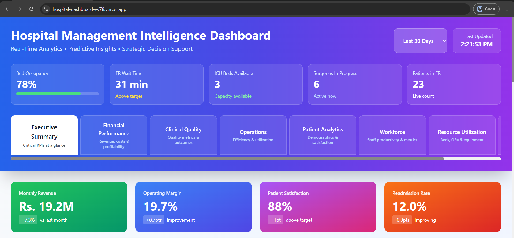

# 🏥 Hospital Management Intelligence Dashboard
### Real-Time Analytics • Predictive Insights • Strategic Decision Support


> A production-ready hospital operations platform combining ensemble machine learning with a modern web interface — giving clinical and administrative teams a single, intelligent view of their entire operation.

🔗 **[Live Demo](https://hospital-dashboard-blush.vercel.app)** · [Report a Bug](https://github.com/iamdushanl/Hospital-Dashboard/issues) · [Request a Feature](https://github.com/iamdushanl/Hospital-Dashboard/issues)

---

## 📸 Preview



---

## 🎯 What It Does

This isn't just a prediction model — it's a **complete hospital management intelligence platform** across 8 specialized tabs, designed to support both real-time clinical decisions and long-term strategic planning.

| Metric | Live Value |
|---|---|
| 💰 Monthly Revenue | Rs. 19.2M (+7.3% vs last month) |
| 📈 Operating Margin | 19.7% (+0.7pts improvement) |
| 😊 Patient Satisfaction | 88% (+1pt above target) |
| 🔁 Readmission Rate | 12.0% (-0.3pts improving) |
| 📊 YoY Revenue Growth | +41.5% |

---

## ✨ Features

### 📋 Executive Summary
Critical KPIs at a glance — bed occupancy, ER wait times, ICU availability, active surgeries, and live patient counts updated in real time.

### 💰 Financial Performance
12-month revenue, cost, and margin trend analysis with interactive charts. Tracks monthly revenue, operating margin, and patient volume in a single view.

### 🏥 Clinical Quality
Quality metrics, patient outcomes, and readmission rate monitoring to support continuous clinical improvement.

### ⚙️ Operations
Department efficiency, utilization rates, and workflow analytics to identify and resolve bottlenecks.

### 👥 Patient Analytics
Full patient risk stratification across 4 tiers with readmission probability and average cost per tier:

| Risk Level | Patients | Readmission Probability | Avg Cost |
|---|---|---|---|
| 🔴 Critical Risk | 45 | 28% | Rs. 18,500 |
| 🟠 High Risk | 128 | 22% | Rs. 12,800 |
| 🟡 Medium Risk | 312 | 14% | Rs. 7,200 |
| 🟢 Low Risk | 515 | 5% | Rs. 3,800 |

### 👨‍⚕️ Workforce
Staff productivity metrics and workforce planning insights.

### 🏗️ Resource Utilization
Bed management, operating room scheduling, and equipment utilization tracking.

### 🔮 Predictive Analytics
AI-driven 30-day forecasts for patient volume, revenue, and operational costs — with visual confidence bands for scenario planning.

---

## 📊 Strategic Initiatives Tracker

Built-in ROI-linked initiative tracking with live progress, deadlines, and status:

| Initiative | Status | Progress | ROI |
|---|---|---|---|
| Reduce Readmissions (12.3% → 10%) | ✅ On Track | 45% | Rs. 280K |
| Improve OR Utilization (82 → 90) | ⚠️ At Risk | 35% | Rs. 145K |
| Increase Patient Satisfaction (87 → 90) | ✅ On Track | 60% | Rs. 95K |
| Reduce Length of Stay (5.8 → 5 days) | 🔴 Delayed | 25% | Rs. 320K |

---

## 🛠️ Tech Stack

| Layer | Technology |
|---|---|
| Frontend | Next.js 14, React 18, TypeScript 5, Tremor, Tailwind CSS |
| Backend | Flask (Python 3.11) |
| ML Models | TabPFN, CatBoost, XGBoost, Scikit-learn |
| Data | Pandas, NumPy, Parquet |
| Infra | Vercel, Git LFS |

---

## 🧠 Machine Learning

The prediction engine uses a **stacked ensemble** approach, combining three complementary algorithms:

| Model | Strength |
|---|---|
| **TabPFN** | Excellent on smaller clinical datasets; zero training overhead |
| **CatBoost** | Handles categorical features (diagnosis codes, departments) natively |
| **XGBoost** | High throughput with strong regularization |

**Ensemble accuracy: 85.2% · AUC-ROC: 0.89**

```
Baseline:    76.2%
CatBoost:    82.5%
XGBoost:     81.8%
TabPFN:      79.3%
─────────────────────
Ensemble:    85.2% ✨
```

Features fed into the models include patient demographics, clinical indicators (labs, vitals, diagnosis codes), temporal admission patterns, and hospital operational metrics.

---

## 🚀 Getting Started

**Prerequisites:** Node.js 18+, Python 3.11+, npm

```bash
# Clone the repository
git clone https://github.com/iamdushanl/Hospital-Dashboard.git
cd Hospital-Dashboard

# Install frontend dependencies
npm install

# Install Python dependencies
pip install -r requirements.txt

# Configure environment variables
cp .env.example .env.local

# Start the development server
npm run dev
```

Open [http://localhost:3000](http://localhost:3000) — you're live. 🎉

**Prefer Docker?**
```bash
docker-compose up --build
```

---

## 📁 Project Structure

```
Hospital-Dashboard/
├── web-dashboard/       # Next.js frontend (App Router)
│   ├── app/             # Pages and layouts
│   └── components/      # Reusable UI components
├── dashboard/           # Flask API backend
│   ├── routes/          # API endpoints
│   └── services/        # Business logic
├── src/                 # ML pipeline
│   ├── etl/             # Data ingestion & processing
│   ├── models/          # Training scripts (per model + ensemble)
│   └── utils/           # Shared helpers
├── data/
│   ├── processed/       # Clean Parquet datasets
│   └── sample/          # Demo/test data
├── notebooks/           # Jupyter analysis notebooks
├── reports/             # Model evaluation results
└── tests/               # Unit & integration tests
```

---

## 🏋️ Training the Models

```bash
# Train individual models
python src/models/train_catboost.py
python src/models/train_xgboost.py
python src/models/train_tabpfn.py

# Run the full ensemble pipeline
python src/models/train_ensemble.py
```

---

## 🚢 Deployment

**One-click deploy to Vercel:**

[](https://vercel.com/new/clone?repository-url=https://github.com/iamdushanl/Hospital-Dashboard)

**Required environment variables:**
```env
NEXT_PUBLIC_API_URL=https://your-api.com
NEXT_PUBLIC_API_KEY=your_api_key
```

---

## 📚 Documentation

| Guide | Description |
|---|---|
| [Beginner's Guide](BEGINNER_GUIDE.md) | New to the project? Start here |
| [Code Walkthrough](CODE_WALKTHROUGH.md) | Deep dive into the architecture |
| [ML Concepts](ML_CONCEPTS.md) | How the prediction pipeline works |
| [Deployment Guide](DEPLOYMENT.md) | Production setup instructions |
| [Contributing](CONTRIBUTING.md) | How to contribute |

---

## 🤝 Contributing

Contributions are welcome!

1. Fork the repository
2. Create your feature branch — `git checkout -b feature/your-feature`
3. Commit your changes — `git commit -m 'Add your feature'`
4. Push and open a Pull Request

Please make sure tests pass and documentation is updated before submitting.

---

## 📄 License

Distributed under the MIT License. See [`LICENSE`](LICENSE) for details.

---

## 👤 Author

**Dushan L**
- GitHub: [@iamdushanl](https://github.com/iamdushanl)
- LinkedIn: [Connect with me](https://linkedin.com/in/your-handle)

---

_Built with a focus on real-world clinical impact — because better data leads to better patient outcomes._
